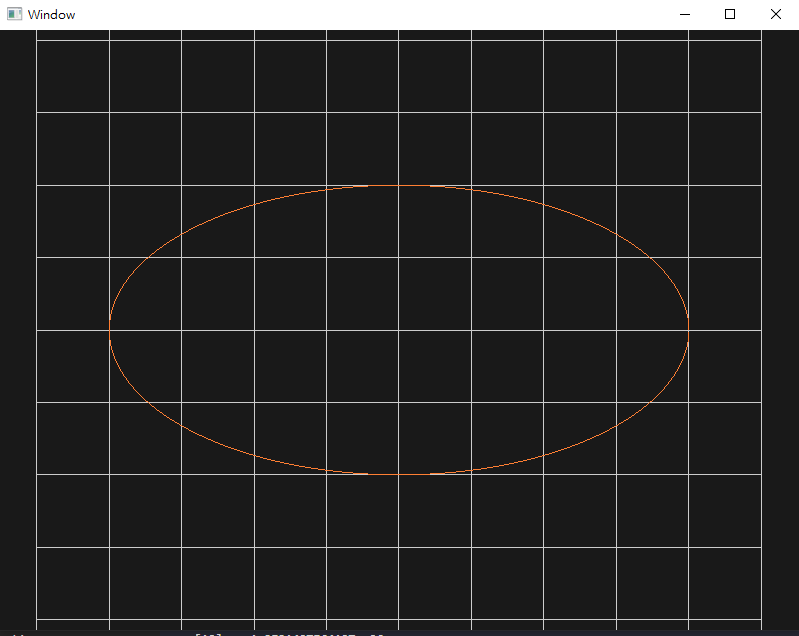

# PREREQUISITES
- vcpkg
- cmake
- set environment variable VCPKG_FEATURE_FLAGS=manifests

# Elliptic Curve Fitting
00957016 高敬庭  
ellipse equation  
$x_i = 4*cos(\theta_i)$  
$y_i = 2*sin(\theta_i)$
## Newton Interpolation
$c$ refers to the coefficient of the interpolation polynomial  
+ N = 8  
  

+ N = 16  
  
  
+ N = 24  
  
  

+ N = 32  
  
  
  

根據上述結果，在N = 8, 16, 24的情況下，最大的error發生在中途(點286)，error最小的在起始點，原本預期最大error會發生在頭或尾，我不清楚是不是跟sin, cos的週期性有關係，我只能確定我自己沒有找到合理的解釋。  
而當N = 32時，在尾端和初始位置都產生了很大的誤差，這是因為coefficient分太細導致誤差變大。  

## Piecewise cubic spline  
  
  
  
  
  
上述的結果中，部分的線段最大error發生在中間，部分則在尾端，Continuity的部分則是有$C^0$但不符合$C^1$，圖中可看到連接點還是有差異，但是差異很小，$C^1$的結果就相差蠻大，可以確定沒有$C^1$-continuity。  
