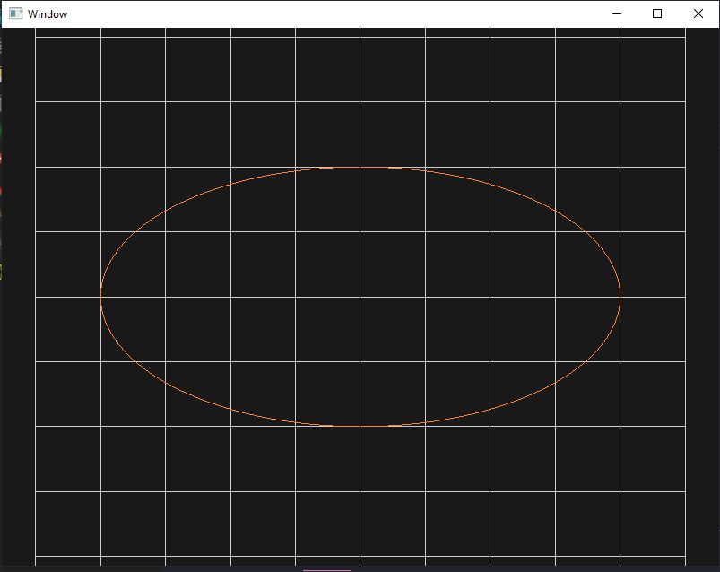
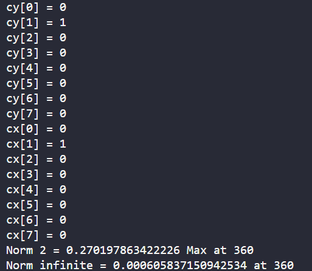
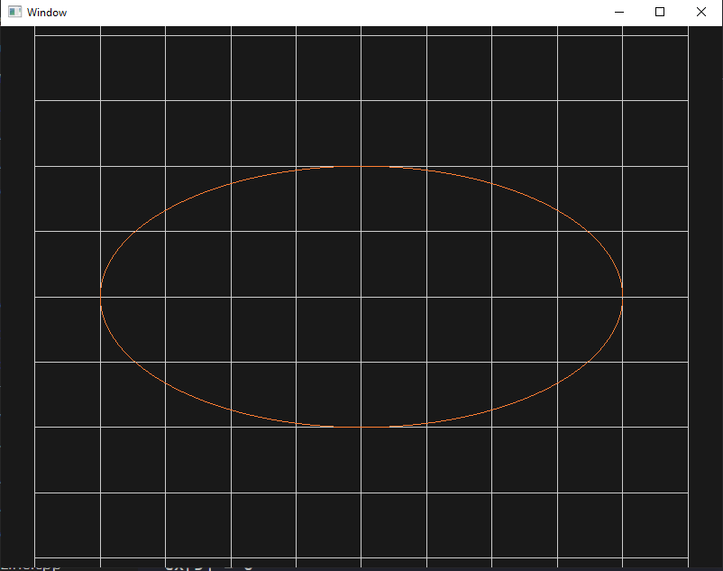
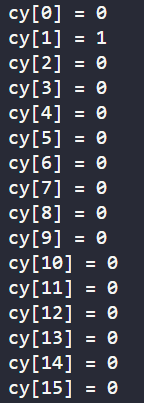
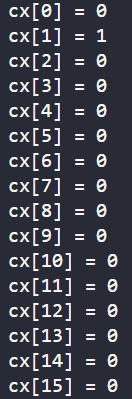
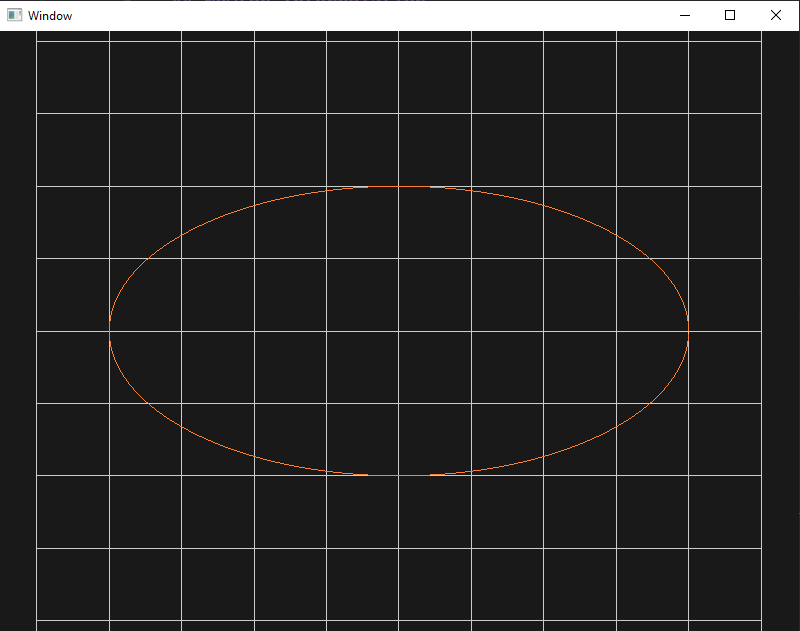
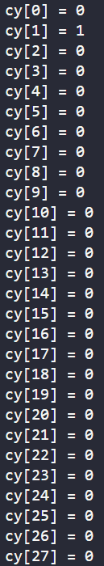
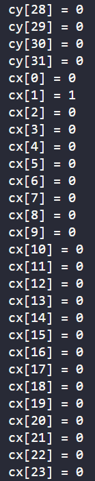
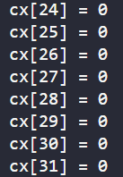

# Elliptic Curve Fitting
00957016 高敬庭  
ellipse equation  
$x_i = 4*cos(\theta_i)$  
$y_i = 2*sin(\theta_i)$
## Newton Interpolation
+ N = 8  
  
  
$c$ refers to the coefficient of the interpolation polynomial  
+ N = 16  
  
  
  
+ N = 32  
  
  
